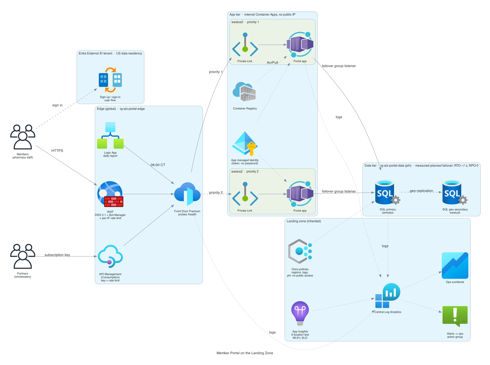

# Azure Landing Zone

A standalone, best-practice Azure landing zone built with bespoke Terraform: a
management-group hierarchy with preventive (Deny) policy guardrails and the
built-in CIS initiative, a hub-and-spoke network with centralized Azure Firewall
egress inspection and Bastion-only admin access, private endpoints, central
logging with Defender for Cloud, a CMK-backed Key Vault, and least-privilege Entra
identity with just-in-time elevation to Prod. It is one of three isolated landing
zones (AWS, Azure, GCP) in this portfolio; the three do not communicate.

## Architecture


## The problem it solves

A subscription with no landing zone lets anyone create anything, anywhere, with no
tags, public IPs on demand, admin ports open to the internet, secrets in code, and
no central log of what happened. This repo is the governed foundation a workload
lands **into**: the guardrails are attached at the hierarchy so every current and
future resource inherits them, the network forces all egress through one inspected
chokepoint, the only admin path is Bastion, and the whole thing is scored against
the CIS Azure Foundations Benchmark. It stands up, proves its guardrails deny, and
tears down under a fixed budget.

## How Azure differs from the AWS and GCP zones

Same design contract, three different control planes:

- **Hierarchy**: Azure uses **management groups** (+ resource groups in this
  single-subscription demo) where AWS uses **Organizations OUs/accounts** and GCP
  uses **folders/projects**. The intended subscription-per-tier split is documented
  in [access-model.md](docs/access-model.md).
- **Preventive guardrails**: **Azure Policy with Deny effects** and the built-in
  **CIS initiative**, where AWS uses **SCPs** and GCP uses **org policies** applied
  at the org root.
- **Egress inspection**: **Azure Firewall + a UDR** forcing `0.0.0.0/0` through it,
  where AWS uses a **Network Firewall in an inspection VPC off a Transit Gateway**
  and GCP uses **Cloud NAT + hierarchical firewall policies**.
- **Admin path**: **Azure Bastion** (no public VM IPs), where AWS uses **SSM
  Session Manager** and GCP uses **IAP-only SSH**.
- **Identity/JIT**: **Entra ID groups + PIM**, where AWS uses **IAM Identity Center
  permission sets** and GCP uses **Cloud Identity + IAM Conditions**.

## What gets built, by tier and pillar

**Governance (free layer).**
- Management-group tree: root → Platform, Workloads (Dev, Test, Prod), Sandbox
  (`terraform/main.tf`). The subscription is associated to Workloads so policy
  inherits down.
- Preventive **Deny** policies at the hierarchy: deny public IP, allowed locations
  (tighter at Prod), and required tags (`owner`, `cost_center`, `environment`,
  `data_classification`) (`terraform/policies.tf`). The deny-public-IP assignment
  excludes the hub resource group (`not_scopes`), where the firewall and bastion
  legitimately hold public IPs: in the intended multi-subscription design the hub
  sits under Platform and is out of scope, but this single-subscription demo
  associates the whole subscription to Workloads, so the hub needs an explicit
  carve-out while every workload spoke stays denied.
- The built-in **CIS Microsoft Azure Foundations Benchmark** initiative assigned at
  root, scored in Defender for Cloud. See [cis-mapping.md](docs/cis-mapping.md).

**Identity.**
- Seven least-privilege Entra persona groups bound at MG scope; **no standing write
  to Prod** (platform engineers are PIM-eligible for Contributor, JIT only)
  (`terraform/identity.tf`, [access-model.md](docs/access-model.md)). PIM eligibility
  needs an Entra ID P2 license, so a tenant without P2 deploys with `enable_pim =
  false`: the persona groups and MG-scoped RBAC still apply, and the JIT-to-Prod
  wiring stays in `identity.tf` behind the flag for a P2 tenant.

**Networking (hourly, flag-gated).**
- Hub VNet `10.0.0.0/16` with correctly named/sized reserved subnets.
- **Azure Firewall** (Standard, threat-intel Deny) with a route table forcing every
  spoke's `0.0.0.0/0` through it (`terraform/firewall_azure.tf`).
- **Azure Bastion** as the only admin path (`terraform/bastion.tf`).
- **Private endpoints + private DNS** for the Key Vault (`terraform/private_endpoints.tf`).
- Three tier spokes (dev `10.1`, test `10.2`, sandbox `10.4`), each peered to the
  hub with a **default-deny NSG** on its workload subnet (`terraform/network.tf`,
  `terraform/modules/landing-zone`). The prod tier (`10.3`) is owned by the separate
  workload root (see below), which stands up the prod VNet and peers it to this hub,
  so the base does not vend a prod spoke.
- An **opt-in FortiGate NVA** is the alternative third-party egress path
  (`terraform/firewall.tf`), mutually exclusive with Azure Firewall.

**Logging, monitoring, encryption, cost.**
- Central **Log Analytics** workspace in its own resource group, receiving the
  subscription **Activity Log**, Key Vault audit events, **Azure Firewall rule
  logs** (resource-specific `AZFW*` tables), and **Bastion session audit**;
  **Defender for Cloud** free CSPM renders the CIS and HIPAA assessments
  (`terraform/monitoring.tf`).
- **Alerting** through one action group: any Deny policy event, any Key Vault 403,
  and a firewall deny spike (`terraform/alerts.tf`). The matching investigation
  queries are saved in [docs/kql/](docs/kql/).
- **Key Vault** with purge protection + soft delete + default-Deny network ACL, and
  a **CMK with a rotation policy** (`terraform/keyvault.tf`).
- A monthly **budget** with actual + forecast alerts (`terraform/budgets.tf`).

**HIPAA technical safeguards.**
- The built-in **HITRUST/HIPAA** initiative at the root management group, scoring
  only (`enforce = false`), so Defender for Cloud scores every tier against HIPAA
  next to CIS.
- `data_classification` limited to `public`, `internal`, `confidential`, `phi` by
  a Deny policy, and a resource group tagged **`phi`** cannot hold a Key Vault,
  storage account, SQL server, or PostgreSQL server with public network access
  (`terraform/hipaa.tf`). See [docs/hipaa-mapping.md](docs/hipaa-mapping.md).

## Workload paved road (prod tier, `workload/`)


A separate Terraform root (`workload/`, its own state) is the prod paved road, the
hourly-billed layer that lands in the prod tier (`10.3`) and is deployed for a demo
then destroyed on its own. It mirrors `aws-landing-zone/workload` (EKS to AKS),
reading the base landing zone over remote state (the hub VNet, the firewall private
IP, the Log Analytics workspace) and peering the prod VNet to the hub.

| Control | What it is |
|---|---|
| Cluster | **Private AKS**: no public control plane, egress only through the hub firewall (`outbound_type=userDefinedRouting`), CMK envelope encryption of etcd secrets (Key Vault KMS), CMK node disks (disk encryption set), Entra RBAC with local accounts disabled, control-plane audit logs to Log Analytics (`workload/aks.tf`). |
| Pod identity | **Workload identity** (OIDC), the IRSA analog: the External Secrets Operator service account federates to an Entra identity scoped to read only the DB secret (`workload/workload-identity.tf`). |
| Data | **PostgreSQL Flexible**, zone-redundant HA, VNet-injected (private), CMK storage, Entra auth, credential in Key Vault (`workload/postgres.tf`). |
| Registry | **ACR Premium**: no public access, CMK, private endpoint, MCR pull-through cache, the only sanctioned image source (`workload/acr.tf`). |
| Private access | Private endpoints + private DNS for ACR and Key Vault, so the private cluster pulls images and reads secrets with no internet path (`workload/private-endpoints.tf`). |
| Backup | Geo-redundant Backup vault with soft delete, protecting the database (`workload/backup.tf`). |
| Network | Prod VNet `10.3`, no public IP/NAT, egress `0.0.0.0/0` to the hub firewall, app/data NSGs (`workload/network.tf`, `workload/segmentation.tf`). VNet flow logs are deferred until the azurerm v4 upgrade. |

Because a private AKS cluster with UDR egress cannot provision unless the firewall
permits AKS's required destinations, `workload/aks-egress-firewall.tf` attaches an
`AzureKubernetesService` FQDN-tag rule collection to the base firewall policy. This
is the Azure analog of the hub firewall's domain allowlist that fronts the private
EKS cluster on the AWS side.

Deploy it after the base (with the hourly firewall up): `make deploy-workload`, tear
it down first with `make destroy-workload`.

## Member portal (`portal/`)



A second workload, shaped like the stack a member-services organization runs:
**Front Door Premium with WAF** in front of **Container Apps in two regions**
(internal, no public IP, reached over Private Link), **Azure SQL with a failover
group** (private endpoints, Entra-only auth, phi-classified), **API Management**
for partners, **Entra External ID** for member sign-in, a **Logic App**
integration, and **Application Insights** with an availability test, a 99.9%
SLO burn-rate alert, and an operations workbook. A drill script measures
failover RTO and RPO instead of claiming them. Design, trade-offs, and runbook:
[docs/portal.md](docs/portal.md).

## State backend (`bootstrap/`)

State lives in a backend this landing zone owns, created and hardened by
`bootstrap/`, the one layer that stands between sessions. Why it moved off the
shared account, and the trade-offs: [docs/adr-state-backend.md](docs/adr-state-backend.md).

| Control | How it is met |
|---|---|
| Destruction protection | `prevent_destroy` on the account and vault, a `CanNotDelete` lock on `rg-alz-tfstate`, and `make destroy` never touches `bootstrap/` |
| Versioning | Blob versioning plus 30-day blob and container soft delete |
| Encryption | Customer-managed key in a dedicated vault, rotated every 90 days, plus infrastructure encryption |
| Access and transport | HTTPS only, TLS 1.2, no public blobs, shared keys disabled (Entra ID + RBAC only) |
| Locking | Native blob lease in the azurerm backend |

One-time move off the old backend:

```bash
cp bootstrap/example.tfvars bootstrap/terraform.tfvars   # set deployer_ip_cidrs
make bootstrap-state                                      # saved plan, against the old backend
terraform -chdir=bootstrap apply bootstrap.tfplan
make migrate-state                                        # copies each root, fails on a count mismatch
```

## Deploy

Credentialed applies run locally (`az login`), plan-before-apply. The deploy is two
steps so the free layer stands up first and the hourly network layer is a separate,
explicit confirmation.

```bash
az login && az account set --subscription <id>

# Copy the example, set deployer_ip_cidrs to your workstation IP so the CMK can be
# created (curl -s https://ifconfig.me), then:
cp terraform/example.tfvars terraform/terraform.tfvars   # gitignored

# 1) Free layer: MGs, Deny policies, CIS, identity, logging, Key Vault CMK
make deploy            # apply with enable_firewall/bastion/private_endpoints = false

# 2) Hourly layer, after reviewing the plan and cost:
make deploy-network    # Azure Firewall + Bastion + UDR + private endpoints
```

Through the `!` bash line (no interactive prompts) use the same commands with
`-auto-approve` and ABSOLUTE `-chdir` paths, e.g.
`terraform -chdir=/Users/jordannelson/azure-landing-zone/terraform apply -auto-approve -var enable_firewall=false ...`.

## Test (prove the guardrails deny)

```bash
make test    # scripts/test-guardrails.sh
```

It does not just check that apply succeeded. It asserts that Azure **refuses**: a
public IP (deny_public_ip), a resource group in a disallowed location
(allowed_locations), an untagged resource group (require-tag), a resource group
with an unknown `data_classification`, and a storage account with public network
access inside a `phi` resource group, each returning `RequestDisallowedByPolicy`;
that the CIS and HITRUST/HIPAA initiatives are assigned; and that Bastion is the
admin path. It prints pass/fail per check and cleans up anything it created.

## Destroy

```bash
make destroy    # terraform destroy, then scripts/verify-teardown.sh
```

`verify-teardown.sh` fails if any hourly-billed resource (Firewall, Bastion,
Standard public IPs, VMs, private endpoints) is still alive.

## Cost and teardown traps

- **Standing after destroy**: ~$1/mo. The Key Vault CMK survives in a soft-deleted
  state (purge protection holds it for the soft-delete window) by design;
  everything else is torn down except the state backend (`bootstrap/`, under
  $1/mo), which is meant to stand.
- **Demo window** (flags on, ~2 hours): Azure Firewall Standard ~$1.25/hr, Bastion
  Basic ~$0.19/hr, private endpoints ~$0.01/hr each, Log Analytics ~free at demo
  volume. Roughly $3, under the portfolio's ~$7 ceiling.
- **Deployer IP drift**: the Key Vault firewall allows only `deployer_ip_cidrs`.
  If your public IP changes between applies, the key read fails with
  `ForbiddenByFirewall`; update the tfvars (`curl -4 ifconfig.me`) and re-apply.
- **New policy assignments take time**: freshly created assignments can take up to
  ~30 minutes to start enforcing, so run `make test` after that window.
- **Traps**: Azure Firewall and any Gateway take **10-30 min** to delete; the
  resource group goes last. `enable_firewall` and `enable_fortigate` are mutually
  exclusive (both force `0.0.0.0/0` through a different next hop). Azure DDoS
  Network Protection and paid Defender plans are designed-for but off (cost).

## FortiGate-VM egress (opt-in alternative)

Instead of Azure Firewall, the hub can route spoke egress through a **Fortinet
FortiGate-VM** NVA (`enable_fortigate=true`, and set `enable_firewall=false`). It
lives in dedicated `snet-fw-untrust` / `snet-fw-trust` subnets (a third-party NVA
cannot share `AzureFirewallSubnet`) and forces every spoke's default route through
its trust interface. Accept the marketplace terms once, then apply:

```bash
az vm image terms accept --publisher fortinet --offer fortinet_fortigate-vm_v5 --plan fortinet_fg-vm
terraform -chdir=terraform apply \
  -var enable_firewall=false -var enable_fortigate=true \
  -var fortigate_admin_password='<StrongPassw0rd!>'
```

This path was previously validated live on Azure (eastus): the FortiGate booted on
`Standard_F2s_v2`, drew a public IP on untrust, and the spoke route tables confirmed
`0.0.0.0/0 -> 10.0.5.4` (VirtualAppliance) on the workload subnets, then torn down
clean. Watch the `Total Regional vCPUs` quota if you also run the VM-Series lab in
[azure-vm-hardening](https://github.com/jordann6/azure-vm-hardening).

## CI

Static gates run through the shared [platform-guardrails](https://github.com/jordann6/platform-guardrails)
toolkit (`.github/workflows/guardrails.yml` → `tf-ci.yml@v1.3.0`): full-history
gitleaks, `fmt` + `validate`, lockfile-committed assertion, tflint, Checkov, and
Trivy config. The credentialed `apply` / `destroy` / `ttl-guard` workflows are
wired but **inactive**: the shared reusable workflows authenticate to AWS only, so
until they gain an `azure/login` OIDC path, Azure applies run locally. Deliberate
Checkov/Trivy trade-offs (public Key Vault for CMK creation, Standard-tier firewall
without IDPS, software-protected key) are inline-skipped with reasons in the code.

## Docs

- [docs/cis-mapping.md](docs/cis-mapping.md): CIS control → Terraform resource, with honest gaps.
- [docs/access-model.md](docs/access-model.md): persona-by-scope matrix, PIM/JIT, single-sub design.
- [docs/accelerator-vs-bespoke.md](docs/accelerator-vs-bespoke.md): why bespoke modules over the ALZ accelerator.
- [docs/hipaa-mapping.md](docs/hipaa-mapping.md): HIPAA 164.312 technical safeguards → Terraform resource, with honest gaps.
- [docs/kql/](docs/kql/): saved investigation queries behind the alerts.
- [docs/adr-state-backend.md](docs/adr-state-backend.md): why state moved to a dedicated, hardened backend.
- [docs/portal.md](docs/portal.md): member portal design, two-clock failover, trade-offs, deploy and drill runbook.

## Tech stack

- **Terraform** `>= 1.6`, `azurerm ~> 3.100`, `azuread ~> 2.50`, dedicated hardened Azure Storage state backend
- **Azure Management Groups + Azure Policy** (Deny) + built-in CIS and HITRUST/HIPAA initiatives
- **Azure Firewall + Bastion + UDR + Private Endpoints/DNS** hub-spoke inspection
- **Log Analytics + Azure Monitor alerts + Defender for Cloud**, **Key Vault + CMK rotation**
- **Entra ID** persona groups + MG-scope RBAC + PIM
- Reusable `landing-zone` spoke-vending module

## Compute baseline

The root management group denies standalone VMs outside this landing zone's
Compute Gallery, disallowed VM sizes, and VMs or VM scale sets without host
encryption. VM scale sets keep their managed images so AKS uses its supported
node OS. Machine Configuration prerequisites and Linux baseline auditing are
assigned alongside periodic update assessment for both Linux and Windows.
These policy assignments add no hourly compute or network resources.

AKS retains Ubuntu nodes and the existing Kubernetes patch channel, adds the
SecurityPatch node OS channel, host encryption, and a four-hour Sunday window
at 02:00 UTC-06:00 (fixed offset). These node changes are validated statically;
the compute baseline session does not deploy AKS or PostgreSQL.

The image pipeline and private management VM passed live proof on 2026-10-05.
The corrected image passed 28 guest hardening checks after a reboot, then a
new private management VM passed the same checks through Azure Run Command.
`make test` passed all 16 guardrail checks, including three isolated compute
policy denials. The VM is the intended target for
`azure-event-driven-remediation` and `azure-incident-responder`; runbook wiring
is deferred. The VM belongs in a separate `compute/` state so it can be removed
before the free base layer.

`make test` includes a compliant gallery-image ARM validation and three isolated
negative templates. Each must identify the expected assignment in a
`RequestDisallowedByPolicy` response. If validation omits policy evaluation,
the helper attempts creation and immediately cleans its dedicated proof resource
group. It fails on unrelated API errors. These proofs require a built image;
they are not claimed complete by Terraform validation alone.

`verify-teardown.sh` fails on inventory errors and checks compute, network and
workload resources, including management NICs/disks and image-build exemptions.
Gallery image versions fail the check because their storage is billed.
Protected backup vaults are reported explicitly.
A pass does not claim a zero cloud invoice or an empty governance state.

Before deploying host-encrypted compute, register the subscription feature:

```sh
az feature register --namespace Microsoft.Compute --name EncryptionAtHost
az feature show --namespace Microsoft.Compute --name EncryptionAtHost --query properties.state -o tsv
az provider register --namespace Microsoft.Compute
```

A workstation IP change requires updating the gitignored `deployer_ip_cidrs`
input. If Key Vault key refresh is blocked, recover only the vault firewall with
a targeted saved plan, review its single-rule diff, and apply that plan before
running a full plan. Keep the default-deny firewall and existing RBAC.

The pipeline publishes `hardened-ubuntu-2204` to the gallery using
local release `azure-vm-hardening` tag `v2.0.1`. See
[the build exemption ADR](docs/adr-compute-image-exemption.md) for the two timed
bootstrap exemptions and local tag resolution. Nothing has been pushed.

The `compute/` root creates a private `Standard_B2s` management VM with
host encryption, Secure Boot, vTPM, SSH-key-only authentication, a system identity,
policy-managed Machine Configuration prerequisites and weekly security patch schedule. Its disk
uses platform-managed keys for this short-lived proof. Guest patching of a custom
image uses a customer-managed schedule; setting AutomaticByPlatform alone does
not enable automatic guest patching for custom images. See
[Microsoft's custom-image guidance](https://learn.microsoft.com/en-us/azure/update-manager/manage-updates-customized-images).

This demo relies on the management subnet's existing outbound access for the VM
agent, Run Command and package repositories. No Azure Firewall, Bastion, NAT
Gateway or workload deployment is part of the compute-only session. Outbound
connectivity supported the live Run Command proof. The first VM exposed an
Apport startup override of `fs.suid_dumpable`; release `v2.0.1` removes Apport
and verifies the baseline after reboot before publishing an image. The corrected
image and a fresh management VM both passed. This is a CIS-informed baseline,
not a claim that every CIS benchmark control has been assessed.

Cost reference checked 2026-10-05: Central US Linux B2s is $0.0499/hour from the
Azure Retail Prices API. Budget up to $0.20/hour for the supervised build or
management proof including disk, temporary build IP and small storage charges.
Gallery definitions are free; published versions use billed storage. `make destroy`
removes compute before workload and base and then runs verification. Never leave
a bake or VM session unattended.

Resume commands (run from a shell with working Azure access):

```sh
terraform -chdir=/Users/jordannelson/azure-landing-zone/terraform init -input=false
terraform -chdir=/Users/jordannelson/azure-landing-zone/terraform plan -var=enable_firewall=false -var=enable_bastion=false -var=enable_private_endpoints=false -var=enable_fortigate=false -out=tfplan -input=false
terraform -chdir=/Users/jordannelson/azure-landing-zone/terraform apply -input=false tfplan
make -C /Users/jordannelson/azure-landing-zone build-image
make -C /Users/jordannelson/azure-landing-zone test
make -C /Users/jordannelson/azure-landing-zone deploy-compute
make -C /Users/jordannelson/azure-landing-zone test-compute
make -C /Users/jordannelson/azure-landing-zone destroy
/Users/jordannelson/azure-landing-zone/scripts/verify-teardown.sh
```

Always run the last two commands even when a build or proof fails. The image
build helper removes its own build group and exemptions on failure. The destroy
helper deletes Packer-created gallery versions through the CLI after compute
teardown, before Terraform removes their image definition and gallery.
