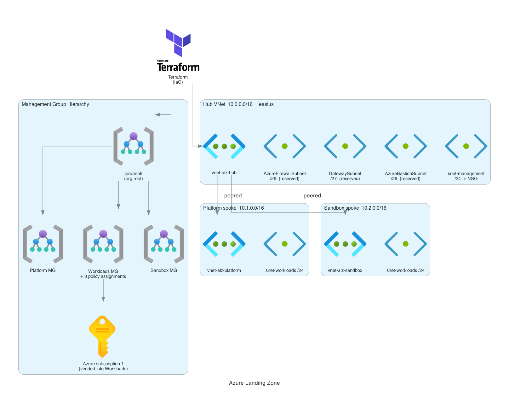
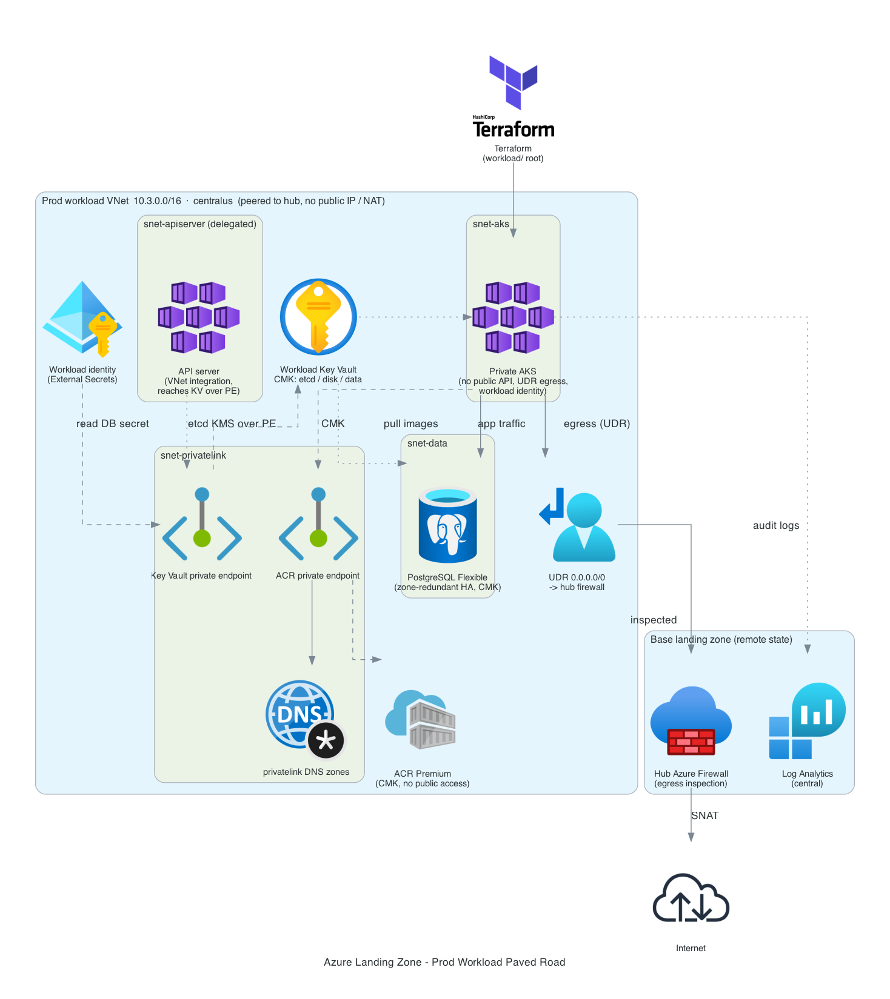

# Case Study: Azure Landing Zone + Workload Paved Road

## Problem

Governance applied after workloads exist is negotiation. Governance applied to a
management group before the first subscription lands there is just the
environment. That distinction decides whether a policy is a guardrail or a
ticket.

But a governed foundation is only half the story. A paved road is only real if a
workload can actually land on it and inherit the controls without hand-wiring
each one. So this project is two layers that mirror the AWS side
(`aws-landing-zone`): a **base landing zone** that establishes the governance a
subscription inherits, and a **prod workload** (private AKS plus a managed
database) that deploys onto it as the reference paved road.

## Architecture

Two Terraform roots against one subscription.

- **Base** (`terraform/`): a management group tree under the tenant root
  (Platform, Workloads, Sandbox, with dev/test/prod beneath Workloads), the
  subscription placed under Workloads, custom Azure Policy definitions plus the
  CIS Azure Foundations initiative assigned at that scope, and a hub VNet
  (10.0.0.0/16) with reserved Firewall/Gateway/Bastion subnets and an Azure
  Firewall for centralized egress inspection.
- **Workload** (`workload/`): a prod VNet (10.3.0.0/16) peered to the hub, a
  private AKS cluster, a zone-redundant HA PostgreSQL Flexible Server, ACR, and
  the identity/KMS/backup plumbing around them. It reads the base outputs
  (firewall policy id, hub VNet) over remote state and attaches its own egress
  rules to the hub firewall.

## What was built

- **Governance that attaches to placement.** Moving the subscription into the
  Workloads management group means every policy assigned there applies
  automatically: require owner tag, deny public IPs, allowed locations, required
  cost-center/environment/data-classification tags, and a prod single-region
  policy, plus the CIS initiative.
- **Private AKS, no public control plane.** `private_cluster_enabled`, OIDC
  issuer and workload identity on, local accounts disabled, and
  `outbound_type = userDefinedRouting` so all egress leaves only through the hub
  Azure Firewall (the workload contributes the AKS-required FQDN allowlist to the
  hub policy).
- **etcd CMK over a private Key Vault.** Kubernetes secrets are envelope-encrypted
  with a customer-managed key reached over a Key Vault private endpoint; the vault
  stays default-Deny. Node OS disks use a separate CMK via a disk encryption set.
- **Zone-redundant HA PostgreSQL.** VNet-injected into a delegated subnet,
  customer-managed-key encrypted, Entra auth enabled, primary in zone 1 with a
  standby in zone 2, protected by a geo-redundant Data Protection backup vault.
- **Least-privilege identities.** ACR behind a private endpoint, External Secrets
  gets a federated workload identity, and the AKS control-plane identity carries a
  custom role scoped to exactly the Key Vault private-endpoint approval actions it
  needs, nothing broader.

## Engineering decisions worth calling out

**Private KMS forces a chain of requirements the platform enforces rather than
documents.** Setting the AKS etcd KMS `key_vault_network_access` to `Private` is
rejected outright with `Vnet integration should be enabled when KeyVault network
access is Private`. Enabling **API Server VNet Integration** (a delegated
`snet-apiserver` subnet) clears that, but then AKS stands up its *own* managed
private endpoint to the vault and fails with `LinkedAuthorizationFailed` because
the cluster identity can create the endpoint but cannot approve the connection,
a permission no built-in Crypto User or Network Contributor role grants. The fix
is a custom role with exactly
`Microsoft.KeyVault/vaults/privateEndpointConnectionProxies/*` and
`.../PrivateEndpointConnectionsApproval/action` on the vault, not weakening the
vault to public. Each error was the platform telling you the next required piece.

**Zone-redundant Postgres HA needs the NSG to allow itself.** HA replicates
between a primary and a standby inside one delegated subnet. A data NSG that
allows 5432 only from the app and AKS subnets and denies the rest silently blocks
the standby from reaching the primary, and the server create fails with
`VnetReplicationToPrimaryNetworkBlocked`. The fix is an explicit intra-subnet
5432 allow above the catch-all deny (outbound is already permitted by the default
`AllowVnetOutBound`).

**The backup role has to be assigned where its actions apply.** The
`PostgreSQL Flexible Server Long Term Retention Backup Role` includes
`Microsoft.Resources/subscriptions/resourceGroups/read`, but assigned at the
*server* scope that action has no effect, so configuring the backup fails with
`AuthorizationFailed` on RG read. Moving the assignment to the resource-group
scope, still narrow, resolves it.

**Region is a capacity decision, not just a config value.** PostgreSQL Flexible
Server is capacity-restricted in the original region for this subscription
(`list-skus` returns an empty version list), so the whole landing zone was moved
to centralus, which has the versions plus zone-redundant HA. The move touched two
tfvars, the two location defaults, and the `allowed_locations` guardrail list.

**Management-group policy propagation is eventually consistent.** On a freshly
built hierarchy, child-scope policy assignments 400 with "policy definition is out
of scope" for up to ~25 minutes until the tree and definition visibility
propagate. The base apply is simply re-run once it settles; the code is correct.

**Drift pinned, not fought.** Azure adds a `Microsoft.Storage` service endpoint to
the Postgres subnet, assigns HA zones, and applies a default node-pool
`max_surge`. Each is declared explicitly (service endpoint, `zone`/
`standby_availability_zone`, `upgrade_settings`) so plans stay clean instead of
churning every run.

## What it deliberately does not do

- **One subscription.** The AWS zone isolates tiers with accounts and the GCP zone
  with projects. With no EA or MCA to vend subscriptions, Azure uses management
  groups and resource groups, so a subscription-level mistake reaches every tier.
- **No threat-detection service.** Detection is the free Defender tier, change
  alerts on every guardrail, and a full audit trail. Paid Defender plans and
  Sentinel are costed and left off ([ADR-0004](adr/0004-detection-tier.md)).
- **Observability is not a retained baseline.** Unlike the AWS root, it cannot
  outlive the base, because the workspace is destroyed with it.

Flow logs and the observability root are built and statically checked but have not
been deployed. The parity table in the README says which items are proven.

## Verification and teardown

Verified against real Azure through the control plane, not the plan file: private
AKS nodes `Ready` with etcd KMS enabled over the KV private endpoint, PostgreSQL
HA `Healthy` (primary zone 1 / standby zone 2), and the backup instance
`ProtectionConfigured`. These results cover the earlier workload demo. Compute
and network resources were removed, but a protected backup vault remains during
its recovery window alongside soft-deleted Key Vaults. This is not a zero-invoice
claim.
Deploy-demo-destroy keeps the reference reproducible for roughly the price of a
couple of hours of runtime (~$2/hr while up) rather than a standing bill.

## Compute baseline proven live

The local compute changes add approved-gallery, VM-size, and host-encryption
controls, guest baseline auditing, and periodic update assessment. AKS retains
its managed Ubuntu image with SecurityPatch and weekly maintenance settings
checked statically. A separate `compute/` root defines a private gallery-backed
management VM and weekly security patches. Packer uses a dedicated build group
and narrow, expiring bootstrap exemptions.

On 2026-10-05, the Packer image passed 28 guest hardening checks after reboot.
A new private management VM booted from that image passed all 28 checks through
Azure Run Command. The 16-check guardrail suite passed, including three isolated
denials for an unapproved image, forbidden size, and missing host encryption.
The first VM had revealed that Apport resets `fs.suid_dumpable` during boot;
the corrected role removes Apport and the image pipeline checks after reboot.
This proves the implemented CIS-informed controls, not full benchmark compliance.
The supervised session excludes Firewall, Bastion, AKS, and PostgreSQL. Its
teardown removes compute, Packer-created image storage, and the free base while
preserving the existing backup vault's protected recovery data.
